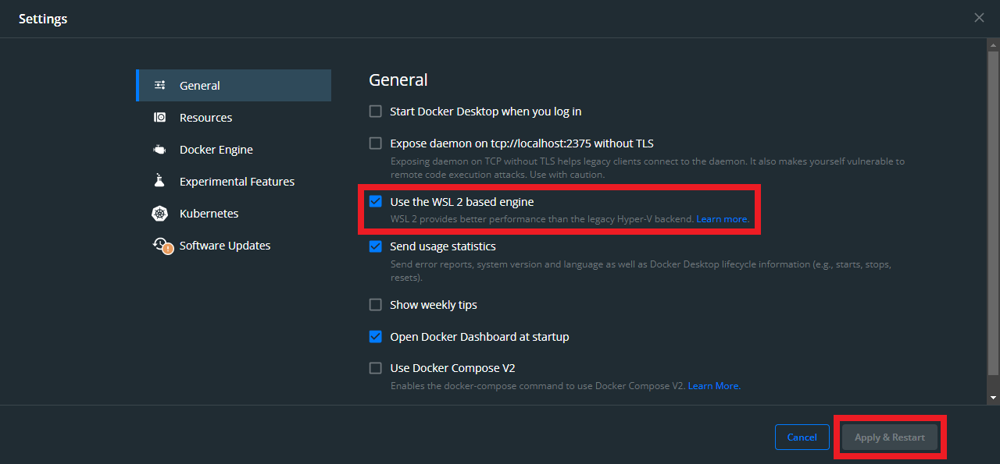
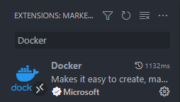
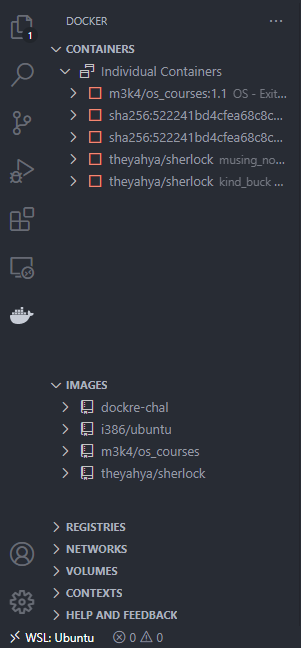
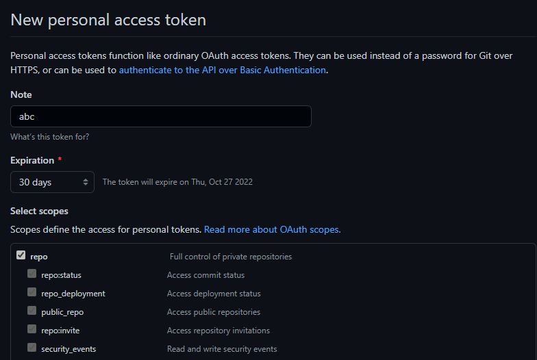
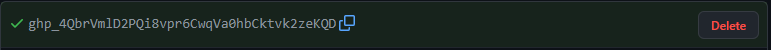

# Installation

1. Install docker desktop from https://www.docker.com/products/docker-desktop/

2. Config wsl2 for docker

- Open `Docker desktop`
- Open setting & tick `Use the WSL2 based engine` & Apply
  
  

3.  Install vscode's plugins (**Remember to run vscode inside WSL!, further commands are also inside WSL, for convinience, you should use vscode's terminal too**)
    

        The docker tab should look like this one:

        

4.  Clone this repo!

    ```bash
    git clone https://github.com/mekanican/nachos_docker
    cd nachos_docker
    ```

5.  Config git's credential

- Open `script.sh`
- Modify these 3 lines:
  - USERNAME= `github's username`
  - EMAIL= `github's email`
  - API_KEY= `github's api key`

* Instruction for api key:

- Open https://github.com/settings/tokens
- `Generate new token` with these option:
  

- API key should look like this:
  

6. Build docker's image

- Run `build.sh` (You can customize the image's name)

  ```bash
  ./build.sh
  ```

7. Make container from image

- Run `make.sh` (You can customize the container's name)
  ```bash
  ./make.sh
  ```

8. Start container (After this, you only need to run `Docker desktop` & this).

- Run `run.sh`

  ```bash
  ./run.sh
  ```

# Edit file with Vscode:

9. `F1` &rarr; `Attach to running container`
10. `Open folder`, `/home/project/nachos` (first time only!)
11. Freely customize extension (suggest c++ extension) & coding!

After those step, only 8 & 9 needed to start developing
